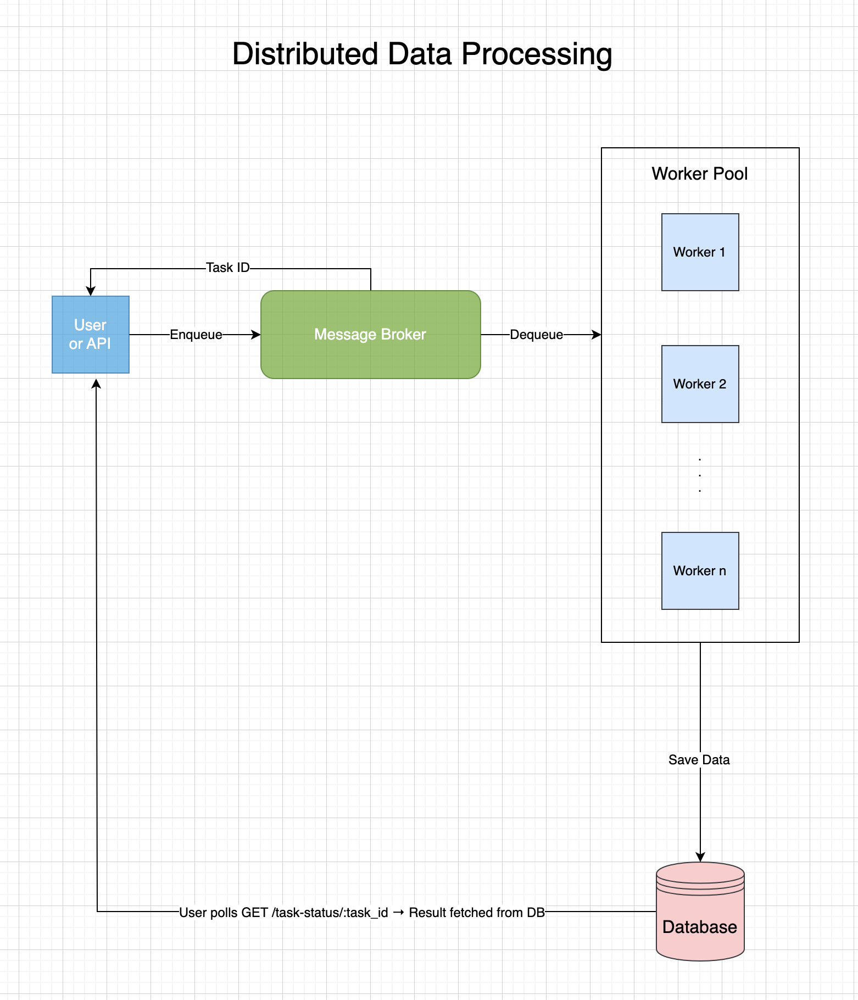

<!-- markdownlint-disable MD033 -->
# Architecture and Features

This repository outlines a system designed for batch processing, likely involving machine learning model predictions and data handling. The architecture is composed of several key components:

## Architecture Overview

The system follows a microservices-like pattern, leveraging a message queue for asynchronous task processing. The main components are:

1. **API Service:**
    - Built with FastAPI, it exposes endpoints for initiating tasks (e.g., predictions) and checking service health.
    - Likely responsible for receiving requests and queuing them for background processing.

2. **Message Queue (RabbitMQ):**
    - Used as a broker to decouple the API service from the worker processes.
    - Tasks are published to queues and consumed by workers.

3. **Celery Workers:**
    - Background workers that consume tasks from the message queue.
    - Responsible for executing computationally intensive operations such as:
        - Machine Learning Model Predictions (`ml_prediction_tasks.py`)
        - Data Processing (`data_processing.py`)
        - Email Notifications (`email_tasks.py`)
        - Periodic tasks (`periodic_tasks.py`)

4. **Machine Learning Module:**
    - Contains logic for training ML models (`ml/train.py`) and utility functions (`ml/utils.py`).
    - Pre-trained models (`models/model.pkl`) are likely loaded by workers for predictions.

5. **Data Storage:**
    - The `data/` directory contains various datasets in formats like `.parquet` and `.json`, used for training, testing, and processing.

6. **Configuration Management:**
    - Uses YAML (`src/config/config.yaml`) and Python settings files (`src/config/settings.py`) for managing application configurations.

7. **Database:**
    - Includes database models (`src/database/db_models.py`), suggesting persistence for results or metadata.

8. **Containerization & Deployment:**
    - `Dockerfile` and `docker-compose-dev.yml` indicate containerization for development and potentially deployment.
    - The `rmq-app/` directory with Helm charts suggests deployment orchestration, likely for RabbitMQ and potentially the worker/API services.

## Key Features

- **Asynchronous Task Processing:** Leverages `Celery` and `RabbitMQ` for efficient handling of long-running tasks.
- **Machine Learning Integration:** Supports ML model training and prediction pipelines.
- **Data Management:** Handles various data formats for processing and analysis.
- **API Endpoints:** Provides a RESTful API for task initiation and monitoring.
- **Containerized Deployment:** Facilitates easy deployment and scaling using Docker and Helm.
- **Configuration Flexibility:** Allows for easy configuration through YAML and Python files.
